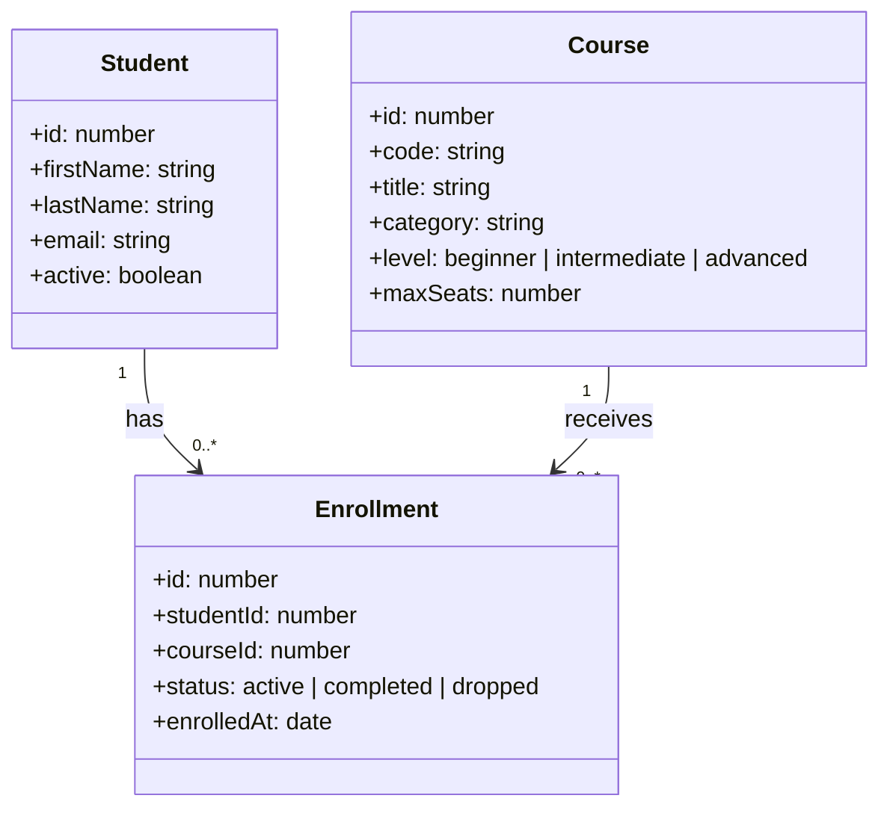

# practica-ia

Starter backend para una mentoría práctica de GitHub Copilot en VS Code.

Este repositorio deja lista la base técnica: API en Node.js + TypeScript + Express, base SQLite local y datos de ejemplo sobre cursos, estudiantes e inscripciones.

## Requisitos

- Node.js 20 o superior
- npm

## Modelo de dominio



## Puesta en marcha

```bash
npm install
npm run db:init
npm run dev
```

La API queda disponible en `http://localhost:3000` y la base local se genera en `data/mentoria.db`.

## Probar la API

No hace falta usar Postman. El repo incluye [requests.http](requests.http) con requests listos para ejecutar desde VS Code.

1. Instalá la extensión `humao.rest-client` si VS Code te la sugiere.
2. Abrí [requests.http](requests.http).
3. Ejecutá cada bloque con `Send Request`.

Con eso podés probar el servicio, los filtros y algunos casos de error sin salir del editor.

## Scripts

- `npm run dev`: arranca la API en modo desarrollo.
- `npm run build`: compila TypeScript a `dist/`.
- `npm run start`: ejecuta la versión compilada.
- `npm run db:init`: crea el archivo SQLite local con esquema y datos.
- `npm run test`: ejecuta los tests del starter.

## Endpoints disponibles

- `GET /`: resumen del proyecto.
- `GET /api/health`: chequeo de servicio y conexión a base.
- `GET /api/courses`: listado de cursos con métricas de inscripción.
- `GET /api/courses?level=beginner`: filtro por nivel.
- `GET /api/students/:id`: detalle de un estudiante con sus inscripciones.

## Estructura principal

- [src/app.ts](src/app.ts): composición de la app Express.
- [src/server.ts](src/server.ts): arranque del servidor.
- [src/routes/courses.ts](src/routes/courses.ts): endpoint de cursos.
- [src/routes/students.ts](src/routes/students.ts): endpoint de estudiantes.
- [src/db/setup.ts](src/db/setup.ts): inicialización y carga del archivo SQLite.
- [src/db/client.ts](src/db/client.ts): helpers de lectura SQL.