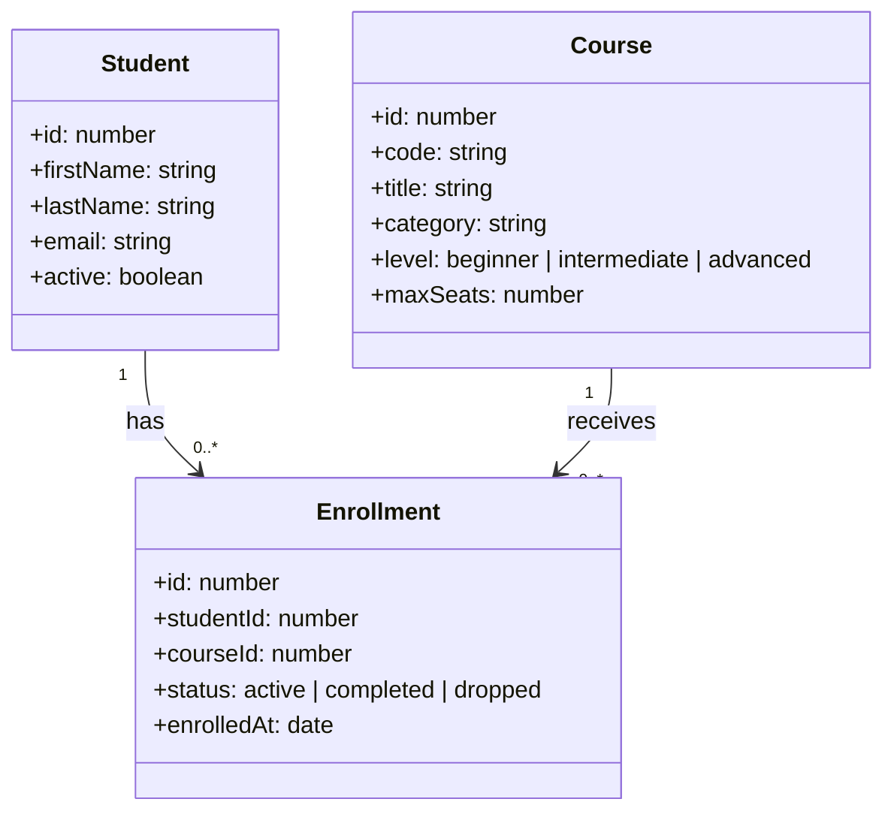

# Guía del participante

## Objetivo

Levantar un backend simple con una base local y entender su dominio antes de empezar a integrar herramientas de IA durante la mentoría.

## Mapa rápido del dominio

El proyecto modela una plataforma de cursos.

- `Course`: representa un curso disponible.
- `Student`: representa una persona que puede inscribirse.
- `Enrollment`: representa la relación entre estudiante y curso, con estado y fecha.



Lectura práctica del diagrama:

- Un estudiante puede tener muchas inscripciones.
- Un curso puede tener muchas inscripciones.
- La tabla `enrollments` conecta ambos lados y agrega información de negocio.

## Requisitos previos

- Tener Node.js 20 o superior instalado.
- Tener VS Code listo para abrir el proyecto.
- Tener acceso al repositorio del starter.

## Pasos iniciales

1. Clonar el repositorio.
2. Instalar dependencias con `npm install`.
3. Crear la base local con `npm run db:init`.
4. Levantar la API con `npm run dev`.
5. Verificar que responda `http://localhost:3000/api/health`.

## Pruebas rápidas sugeridas

El repo incluye el archivo [requests.http](../requests.http) que podés usar directamente desde VS Code, en lugar de usar Postman.

Instalá la extensión [REST Client](https://marketplace.visualstudio.com/items?itemName=humao.rest-client), abrí el archivo y hacé click en "Send Request" arriba de cada bloque. Eso es suficiente para probar todos los endpoints del starter sin salir del editor.

Los requests disponibles cubren:

- `GET /api/health` — estado del servicio
- `GET /api/courses` — todos los cursos
- `GET /api/courses?level=intermediate` — filtro por nivel
- `GET /api/students/1` — detalle de un estudiante con sus inscripciones
- Casos que devuelven error (400 y 404) para validar el comportamiento

## Generar instruction de workspace

Ruta recomendada:

1. Abrí Chat.
2. Tocá el engranaje para abrir Chat Customizations.
3. Entrá en Instructions.
4. Elegí Generate Instructions -> New Instructions (Workspace).
5. Pegá este prompt exacto:

```text
Create a workspace instruction for this repository.

Requirements:
1) Before answering any technical question, always include a section titled "Supuestos que estoy haciendo" and list explicit assumptions about domain, schema, or context.
2) When writing or explaining SQL for this project, always include one concrete example using existing seed data from src/db/seed.sql.
3) Do not invent tables or columns. If information is missing, say it clearly and ask for clarification.

Output:
- Generate the instruction file in workspace scope.
- Keep it short, clear, and enforceable.
```

Cómo validar que funciona:

1. En el chat, pedí: "Quiero una query para estudiantes con más de una inscripción activa".
2. Revisá que aparezca la sección "Supuestos que estoy haciendo".
3. Revisá que incluya un ejemplo real usando datos de seed.

## Planificar skill de documentación de cambios

Objetivo de la skill:

- Cada vez que se pida implementar cambios de código, generar también un archivo Markdown de documentación del cambio.
- El archivo debe tener un nombre tipo código, único e identificable (por ejemplo: `chg-20260414-153045-auth-fix.md`).
- El contenido debe incluir fecha, resumen de cambios y detalles técnicos relevantes.

Comportamiento esperado de la skill:

1. Al detectar una solicitud de cambios de código, proponer y crear un archivo `.md` de documentación asociado.
2. Usar una convención de nombre única basada en timestamp y tema corto.
3. Incluir fecha/hora del cambio en encabezado.
4. Registrar qué se cambió, por qué, impacto esperado y riesgos conocidos.
5. Incluir al menos una tabla de resumen (archivos afectados, tipo de cambio, estado).
6. Incluir ejemplos antes/después cuando aplique.
7. Incluir al menos un diagrama Mermaid (flujo, secuencia o arquitectura del cambio).

Estructura sugerida del documento generado por la skill:

- Título del cambio
- Fecha y código único
- Contexto
- Cambios implementados
- Tabla de archivos/modificaciones
- Ejemplos relevantes
- Diagrama Mermaid
- Riesgos y pendientes

Prompt sugerido para crear la skill en Workspace:

```text
Create a workspace skill named change-doc-writer.

Purpose:
Automatically generate a Markdown change document whenever code changes are requested.

Core behavior:
1) Trigger when user asks to implement code changes.
2) Create a unique code-like filename using timestamp and short topic.
3) Include date/time in the document.
4) Summarize relevant technical changes.
5) Include at least one markdown table.
6) Include examples (input/output or before/after).
7) Include at least one Mermaid diagram.

Output requirements:
- Workspace skill, concise and practical instructions.
- Include trigger words in description: documentacion, cambios, changelog, markdown, mermaid.
- Emphasize that each implementation request should produce or update a change doc file.
```

Prueba sugerida cuando se implemente:

- Pedí: "Agregá una nueva entidad llamada Professor, que se relacionen con cursos mediante una entidad Professor_Course".
- Asegurate de citar la skill en el prompt.

## Implementar servidor MCP para consultas de base de datos

El MCP (Model Context Protocol) permite que Copilot Chat ejecute consultas SQL de lectura directamente sobre la base de datos local, sin necesidad de escribir SQL manualmente. El servidor MCP actúa como intermediario: tu pregunta en lenguaje natural → Copilot traduce a SQL → el servidor la valida y ejecuta → devuelve resultados.

**Importante:** El servidor MCP debe estar corriendo en **un terminal separado** mientras usas Chat. Necesitás dos terminales abiertas simultáneamente.

### Paso 1: Instalar dependencias para el MCP

Las dependencias necesarias ya están en `package.json`. Si no las tenés, instalálas:

```bash
npm install --save-dev @modelcontextprotocol/sdk sql.js zod
```

### Paso 2: Crear estructura de archivos para el MCP

1. Creá la carpeta `mcp/policies` si no existe:

   ```bash
   mkdir -p mcp/policies
   ```

2. Creá el archivo `mcp/policies/read-only.ts` (politica de solo lectura):

   ```typescript
   const FORBIDDEN_SQL_PATTERN =
     /\b(insert|update|delete|drop|alter|create|truncate|attach|detach|replace|vacuum|reindex|analyze|pragma)\b/i;

   function hasMultipleStatements(sql: string): boolean {
     const compact = sql.trim();
     if (compact.length === 0) {
       return false;
     }

     const semicolons = [...compact.matchAll(/;/g)].length;

     if (semicolons === 0) {
       return false;
     }

     return compact.endsWith(";") ? semicolons > 1 : true;
   }

   export function validateReadOnlySql(
     sql: string,
   ): { valid: true } | { valid: false; reason: string } {
     const trimmed = sql.trim();

     if (trimmed.length === 0) {
       return { valid: false, reason: "La consulta no puede estar vacia." };
     }

     if (hasMultipleStatements(trimmed)) {
       return {
         valid: false,
         reason: "Solo se permite una sentencia SQL por consulta.",
       };
     }

     if (!/^(select|with)\b/i.test(trimmed)) {
       return {
         valid: false,
         reason:
           "Solo se permiten consultas de lectura (SELECT o WITH ... SELECT).",
       };
     }

     if (FORBIDDEN_SQL_PATTERN.test(trimmed)) {
       return {
         valid: false,
         reason:
           "La consulta contiene una operacion no permitida para el modo read-only.",
       };
     }

     return { valid: true };
   }
   ```

3. Creá el archivo `mcp/server.ts` (servidor MCP principal):

   ```typescript
   import fs from "node:fs";
   import path from "node:path";
   import { createRequire } from "node:module";
   import { McpServer } from "@modelcontextprotocol/sdk/server/mcp.js";
   import { StdioServerTransport } from "@modelcontextprotocol/sdk/server/stdio.js";
   import initSqlJs, { type Database, type QueryExecResult } from "sql.js";
   import { z } from "zod";
   import { validateReadOnlySql } from "./policies/read-only";

   const moduleRequire = createRequire(__filename);
   const sqlJsWasmPath = moduleRequire.resolve("sql.js/dist/sql-wasm.wasm");
   const dbFilePath = path.join(process.cwd(), "data", "mentoria.db");

   let sqlJsPromise: ReturnType<typeof initSqlJs> | undefined;

   async function getSqlJs() {
     if (!sqlJsPromise) {
       sqlJsPromise = initSqlJs({
         locateFile: (file: string) =>
           file === "sql-wasm.wasm" ? sqlJsWasmPath : file,
       });
     }
     return sqlJsPromise;
   }

   async function openDatabase(): Promise<Database> {
     if (!fs.existsSync(dbFilePath)) {
       throw new Error(
         `No se encontro ${dbFilePath}. Ejecuta 'npm run db:init' antes de iniciar el MCP.`,
       );
     }
     const SQL = await getSqlJs();
     return new SQL.Database(fs.readFileSync(dbFilePath));
   }

   function rowsFromExecResult(
     result: QueryExecResult[],
   ): Record<string, unknown>[] {
     if (result.length === 0) {
       return [];
     }
     const first = result[0];
     return first.values.map((valueRow) => {
       const row: Record<string, unknown> = {};
       first.columns.forEach((column, index) => {
         row[column] = valueRow[index] ?? null;
       });
       return row;
     });
   }

   function okText(payload: unknown) {
     return {
       content: [
         { type: "text" as const, text: JSON.stringify(payload, null, 2) },
       ],
     };
   }

   const server = new McpServer({
     name: "mentorias-ia-sqlite",
     version: "1.0.0",
   });

   server.registerTool(
     "list_tables",
     {
       description: "Lista las tablas disponibles en la base SQLite.",
       inputSchema: {},
     },
     async () => {
       const db = await openDatabase();
       try {
         const rows = rowsFromExecResult(
           db.exec(
             "SELECT name FROM sqlite_master WHERE type = 'table' AND name NOT LIKE 'sqlite_%' ORDER BY name ASC",
           ),
         );
         return okText({ tables: rows.map((item) => item.name) });
       } finally {
         db.close();
       }
     },
   );

   server.registerTool(
     "describe_table",
     {
       description: "Describe columnas, tipos y nullability de una tabla.",
       inputSchema: {
         table: z.string().min(1).describe("Nombre de tabla."),
       },
     },
     async ({ table }) => {
       if (!/^[a-z_][a-z0-9_]*$/i.test(table)) {
         throw new Error("Nombre de tabla invalido.");
       }
       const db = await openDatabase();
       try {
         const tableExists = rowsFromExecResult(
           db.exec(
             "SELECT name FROM sqlite_master WHERE type = 'table' AND name = ? LIMIT 1",
             [table],
           ),
         ).length;
         if (!tableExists) {
           throw new Error(`La tabla '${table}' no existe.`);
         }
         const columns = rowsFromExecResult(
           db.exec(`PRAGMA table_info(${table})`),
         );
         return okText({ table, columns });
       } finally {
         db.close();
       }
     },
   );

   server.registerTool(
     "run_select_query",
     {
       description: "Ejecuta una consulta SQL read-only (solo SELECT/WITH).",
       inputSchema: {
         query: z.string().min(1).describe("Consulta SQL de lectura."),
         maxRows: z
           .number()
           .int()
           .min(1)
           .max(200)
           .optional()
           .describe("Maximo de filas en la respuesta."),
       },
     },
     async ({ query, maxRows = 50 }) => {
       const validation = validateReadOnlySql(query);
       if (!validation.valid) {
         throw new Error(validation.reason);
       }
       const db = await openDatabase();
       try {
         const limitedQuery = `SELECT * FROM (${query.trim().replace(/;$/, "")}) AS q LIMIT ${maxRows}`;
         const rows = rowsFromExecResult(db.exec(limitedQuery));
         return okText({
           rowCount: rows.length,
           maxRows,
           rows,
         });
       } finally {
         db.close();
       }
     },
   );

   async function main() {
     const transport = new StdioServerTransport();
     await server.connect(transport);
     console.error("MCP SQLite server running on stdio");
   }

   main().catch((error: unknown) => {
     console.error("MCP server error:", error);
     process.exit(1);
   });
   ```

4. Creá el archivo `mcp/tsconfig.json` para evitar errores de tipos:

   ```json
   {
     "compilerOptions": {
       "target": "ES2022",
       "module": "Node16",
       "moduleResolution": "Node16",
       "strict": true,
       "esModuleInterop": true,
       "types": ["node"],
       "skipLibCheck": true,
       "noEmit": true
     },
     "include": ["./**/*.ts"]
   }
   ```

### Paso 3: Levantar el servidor MCP en un terminal separado

**Importante:** Mantené tu terminal de desarrollo (`npm run dev`) abierta en otro tab o ventana. Ahora:

1. Abrí **un nuevo terminal** (no cierres el anterior).
2. Ejecutá:
   ```bash
   npm run mcp:start
   ```
3. Deberías ver:
   ```
   MCP SQLite server running on stdio
   ```
   El servidor está listo. Dejalo corriendo mientras usas Chat.

### Paso 4: Conectar el MCP desde VS Code Chat Customizations

1. Abrí Chat (Ctrl+Shift+I).
2. Hacé clic en el **engranaje ⚙️** para abrir Chat Customizations.
3. Entrá en **Chat Customizations → MCP Servers -> Add Server**.
4. Se abrirán opciones en la barra principal de búsqueda. Elegí la opción **Command (stdio)**, ingresá el nombre **mentoria-sqlite-local** y seguí los pasos. Asegurate que el archivo quede así:

   ```json
   {
     "servers": {
       "mentoria-sqlite-local": {
         "type": "stdio",
         "command": "npm",
         "args": ["run", "mcp:start"],
         "cwd": "${workspaceFolder}"
       }
     }
   }
   ```

   **Detalles importantes:**
   - **type:** `"stdio"` (comunicación por entrada/salida estándar)
   - **command:** `"npm"` (ejecutá npm, no directamente el servidor)
   - **args:** `["run", "mcp:start"]` (usa el script del package.json)
   - **cwd:** `"${workspaceFolder}"` (asegura que se ejecute desde la carpeta del proyecto)

5. Guardá la configuración.
6. Cerrá y reabrí Chat para recargar la conexión.

### Paso 5: Pruebas básicas del MCP

#### Prueba 1: Listar tablas disponibles

En Chat, escribí:

```text
Usá el MCP para listar las tablas disponibles en la base de datos.
```

Esperado: Copilot invoca `list_tables` y devuelve:

```
- courses
- enrollments
- students
```

#### Prueba 2: Consulta con joins

En Chat, escribí:

```text
Usá el MCP para darme los estudiantes con más de una inscripción activa en 2026.
```

Esperado: Copilot invoca `run_select_query` con un SQL que hace JOIN entre `students` y `enrollments`, filtra status="active" en 2026, agrupa por estudiante y cuenta inscripciones. Resultado debe incluir al menos a Elena Suarez con 2 inscripciones activas.

**Ejemplo de salida esperada:**

```json
{
  "rowCount": 1,
  "maxRows": 50,
  "rows": [
    {
      "id": 5,
      "first_name": "Elena",
      "last_name": "Suarez",
      "active_enrollments": 2
    }
  ]
}
```

### Validación final

Si ambas pruebas funcionan sin errores:

- ✅ El MCP descubre esquema correctamente
- ✅ Copilot traduce lenguaje natural a SQL automáticamente
- ✅ Las consultas se validan como read-only
- ✅ Los resultados se devuelven en tiempo real

Si algo falla, revisá:

1. El servidor MCP sigue corriendo en su terminal (sin mensajes de error).
2. La configuración en Chat Customizations → MCP es exacta.
3. La base de datos existe (`npm run db:init` antes).
4. No hay conflictos de puertos o permisos de archivo.
